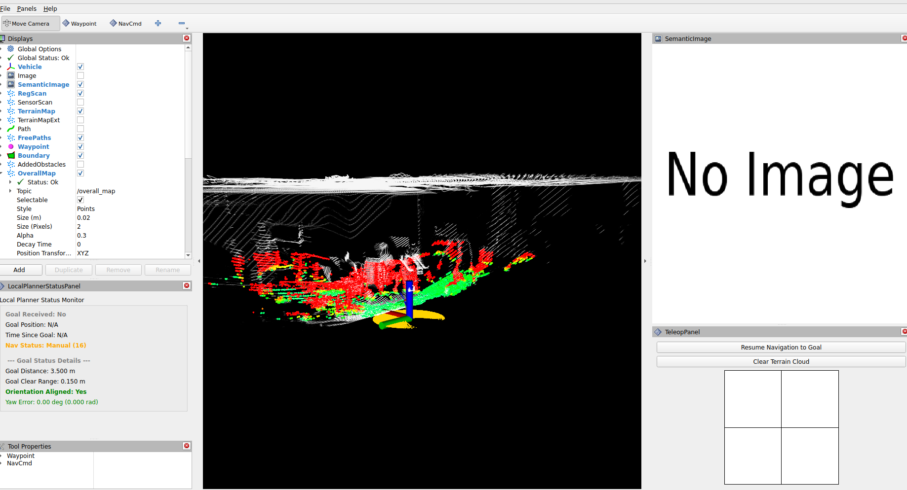

# Vega Navigation Stack

Obstacle avoidance, route planning, mapping, relocalization, and more for Vega-1 Plus.

> **Recommended:** Run this stack on the Vega-1 Plus's onboard Jetson Thor via Docker to minimize control loop latency.

---

## Table of Contents

- [Setup](#setup)
  - [Build](#build)
  - [Configure LiDAR and PTP Clock](#configure-lidar-and-ptp-clock)
  - [Optimize ROS2 Communication](#optimize-ros2-communication)
  - [Test SuperOdom](#test-superodom)
  - [Test Autonomy Stack](#test-autonomy-stack)
- [Navigation on Vega-1 Plus](#navigation-on-vega-1-plus)
  - [DualSense Controller (optional)](#optional-setup-dualsense-controller)
  - [Run the Velocity Subscriber](#run-the-velocity-subscriber)
  - [Planning and SLAM Overview](#planning-and-slam-overview)
- [TODO](#todo)
- [Credits](#credits)

---

## Setup

### Build

#### Option 1: Docker (Recommended)

See the [Docker README](./docker/README.md).

#### Option 2: Build from Source

Clone the repo with submodules:

```bash
git clone https://github.com/dexmate-ai/vega-navigation-stack.git --recursive

# If you already cloned without --recursive:
git submodule update --init --recursive
```

Then follow the [SuperOdom setup instructions](./src/slam/super_odom/readme.md), and build:

```bash
colcon build --symlink-install
```

---

### Configure LiDAR and PTP Clock

We use a gPTP software clock from the Ethernet interface as the synchronization source for the LiDAR.

#### On Vega (default IPs)

| LiDAR | Model | IP |
|---|---|---|
| Front | RS Airy | `192.168.50.42` |
| Rear | RS E1R | `192.168.50.43` |

Make sure you can ping both addresses. If not, contact [contact@dexmate.ai](mailto:contact@dexmate.ai).

#### On a Custom LiDAR

Follow the vendor's instructions. For reference, RoboSense LiDARs default to `192.168.1.200` and send scan data to `192.168.1.102`.

#### Start the PTP Clock

```bash
cd system_cfgs/ptp_clock
sudo ptp4l -i mgbe0_0 -ml 6 -f automotive-master.cfg
sudo phc2sys -a -rr
```

- `ptp4l` creates a software clock on network interface `mgbe0_0`. Change it to the network interface connects to your lidar, e.g., `enp3s0`.
- `phc2sys` synchronizes it with the system clock.

#### Verify LiDAR Data

Build and launch the RoboSense SDK:

```bash
colcon build --symlink-install --packages-select rslidar_msg rslidar_sdk
source install/setup.bash
ros2 launch rslidar_sdk start.py
rviz2 -d src/utilities/rslidar_sdk/rviz/rviz2.rviz
```

Check that the LiDAR timestamp is synced:

```bash
ros2 topic echo /rslidar_points --no-arr --no-daemon
```

> **Expected:** A large timestamp value matching your current Unix time means PTP sync is working. A small value (hundreds or thousands) means sync has not occurred.

---

### Optimize ROS2 Communication

#### DDS (not required for Docker)

We recommend `rmw_cyclonedds_cpp` for best performance:

```bash
sudo apt install ros-jazzy-cyclonedds
export RMW_IMPLEMENTATION=rmw_cyclonedds_cpp
```

#### Network Buffer

The RS Airy pointcloud frames exceed 1 MB, so the kernel receive buffer must be increased:

```bash
sudo sysctl -w net.core.rmem_max=2147483647
```

To make this permanent, add the following to `/etc/sysctl.d/10-cyclone-max.conf`:

```
net.core.rmem_max=2147483647
```

Set the Cyclone DDS URI to configure the minimum socket buffer size:

```bash
export CYCLONEDDS_URI=${PATH_TO_AUTONOMY_STACK_DIR}/system_cfgs/cyclone_dds_setup.xml
```

---

### Test SuperOdom

Follow the [SuperOdom setup guide](./src/slam/super_odom/readme.md). Move the robot and verify that SLAM is stable.

---

### Test Autonomy Stack

Build the full stack:

```bash
colcon build --symlink-install
```

Launch the system:

```bash
ros2 launch vehicle_simulator system_real_robot_rs_airy.launch.py
```

You should see the following RViz view:




Drag the robot around and observe in RViz to verify all components are working.

---

## Navigation on Vega-1 Plus

### (Optional) Setup DualSense Controller

You can use a [DualSense controller](https://www.playstation.com/en-us/accessories/dualsense-wireless-controller/) with an [8BitDo adapter](https://shop.8bitdo.com/products/8bitdo-wireless-usb-adapter-2-for-switch-windows-mac-raspberry-pi-compatible-with-xbox-series-x-s-controller-xbox-one-bluetooth-controller-switch-pro-and-ps5-controller) to publish joystick commands to the local planner.

```bash
sudo apt install libhidapi-dev

sudo tee /etc/udev/rules.d/70-dualsense.rules << 'EOF'
# USB
KERNEL=="hidraw*", SUBSYSTEM=="hidraw", ATTRS{idVendor}=="054c", ATTRS{idProduct}=="0ce6", MODE="0666"
# Bluetooth
KERNEL=="hidraw*", SUBSYSTEM=="hidraw", KERNELS=="0005:054C:0CE6.*", MODE="0666"
EOF

sudo udevadm control --reload-rules
sudo udevadm trigger
```

Plug in the adapter and confirm `/dev/input/js0` appears.

---

### Run the Velocity Subscriber

The planner publishes velocity in the vehicle frame. We use `dexcontrol-rosbridge` to forward it to the robot.

```bash
cd robot_interface
# First-time setup (create venv if needed):
# uv venv --system-site-packages .venv
# uv pip install -e ./dexcontrol-rosbridge
# uv pip install dextop
# source .venv/bin/activate
```

Set your robot credentials:

```bash
export ROBOT_NAME=<your_robot_name>
export ZENOH_CONFIG=<path_to_zenoh_config>  # e.g., ~/.dexmate/comm/zenoh/[cert_name].dzcfg
```

> **Note:** If running on the onboard Jetson Thor, `echo $ROBOT_NAME` will give you the robot name. For the Zenoh certificate, contact your admin.

#### Differential Drive Mode

Fix the steering.

```bash
ros2 launch vehicle_simulator system_real_robot_rs_airy.launch.py

# In another terminal:
python3 dexcontrol-rosbridge/scripts/subscribe_chassis_vel.py
```

#### Omni-Directional Mode

```bash
ros2 launch vehicle_simulator system_real_robot_rs_airy_omni.launch.py

# In another terminal:
python3 dexcontrol-rosbridge/scripts/subscribe_chassis_vel.py --omni
```

> **Known issue:** In omni mode, wheels may oscillate near the goal due to sensitivity of steering when velocity direction changes rapidly.

---

### Planning and SLAM Overview

**Planning** is based on state lattice planning ([IROS 2019 paper](https://frc.ri.cmu.edu/~zhangji/publications/IROS_2019.pdf)). Motion primitives are sampled in control space and trimmed using a terrain map point cloud.

**SLAM** uses a lightweight LiDAR-SLAM framework with decoupled LiDAR and IMU states ([details](https://arxiv.org/pdf/2104.14938)). Any SLAM system can be used — just provide `/state_estimation` and `/registered_scan` to the planning stack.

---

## TODO

- [ ] Multi-LiDAR support
- [ ] Smoother omni-directional wheel controller

---

## Credits

| Component | Source |
|---|---|
| Navigation Stack | [Autonomy Stack Go2](https://github.com/jizhang-cmu/autonomy_stack_go2) — [Zhang Lab, CMU](https://frc.ri.cmu.edu/~zhangji/) |
| LiDAR SLAM | [Super Odometry](https://github.com/superxslam/SuperOdom) — [AirLab, CMU](https://theairlab.org/) |
| Robot Control | [dexcontrol](https://github.com/dexmate-ai/dexcontrol) & [dexcontrol-rosbridge](https://github.com/dexmate-ai/dexcontrol-rosbridge) |
